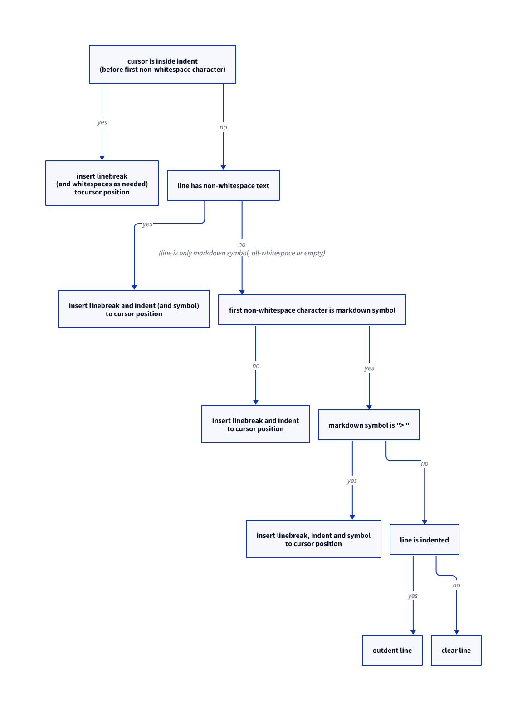

# markdown-leaner-newline README

- Insert Markdown list and citation symbols (`- `, `+ `, `* `, `1. `, `> `) and indentation at the beginning of the next line as well.
- **Do not increment the index in a numbered list**.
    - No extra changes are made except for the insertion of symbols and indentation.
    - If a line break occurs on a line beginning with `1.`, `1.` is inserted on the next line as well (not such as `2. `, `3. `, ...).

## LOGIC

---

**Enjoy!**
